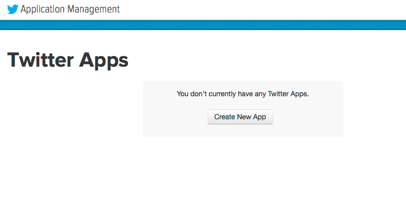
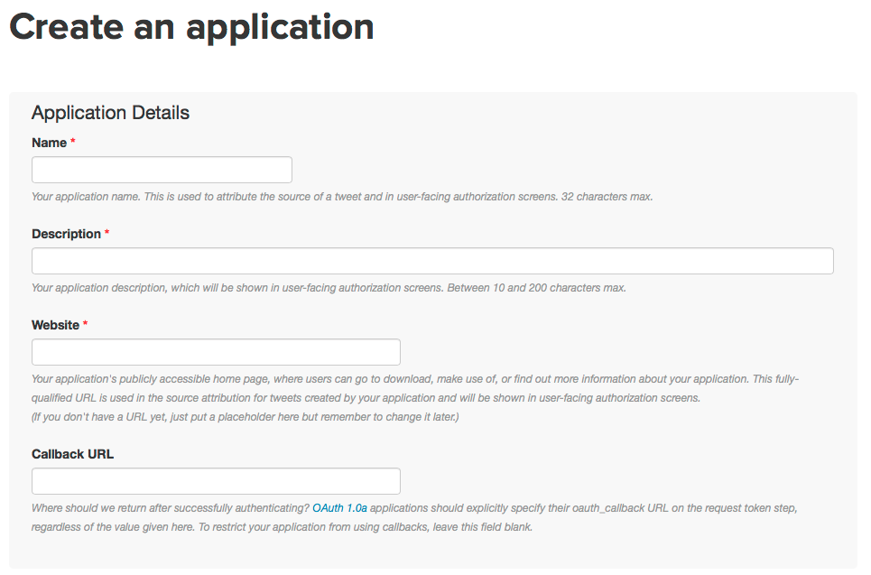
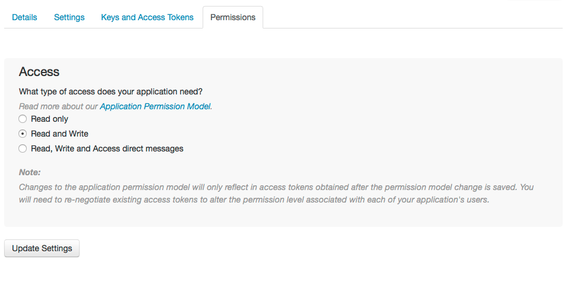

# tweets-collector
Collect tweets (tweets corpus) using Twitter API. 

Collection can be based on hashtags or keywords.

## install requirements 
```pip install -r requirements```
 
 
## Getting your API keys from Twitter
1. Go to [https://apps.twitter.com](https://apps.twitter.com) and create an new app


2. Provide a name and describe for the app, then specify permissions 


3. Then go to **keys and access management** tab 


4. put these info in [credentials.txt](twitter-files/credentials.txt) and in [api_keys.ps](api_keys.py) files.


## query_tweets.py Usage

```
usage: query_tweets.py [-h] -k KEYWORDS_FILE -o OUTFILE -n NUMBER

collect tweets based on keywords

optional arguments:
  -h, --help            show this help message and exit
  -k KEYWORDS_FILE, --keywords-file KEYWORDS_FILE
                        keywords or hashtags file. The file should contain one
                        keyword/hashtag per line
  -o OUTFILE, --outfile OUTFILE
                        the output json file path and prefix.
  -n NUMBER, --number NUMBER
                        the number of tweets that you want to collect


```


## json2text.py Usage
 
```
usage: json2text.py [-h] -i JSON_DIR -o OUT_DIR

extract tweet texts from json

optional arguments:
  -h, --help            show this help message and exit
  -i JSON_DIR, --json-dir JSON_DIR
                        tweets json directory
  -o OUT_DIR, --out-dir OUT_DIR
                        the output directory.

```


## stream_geolocation.py Usage 

Get Geo locations from [http://boundingbox.klokantech.com/](http://boundingbox.klokantech.com/)
```
usage: stream_geolocation.py [-h] -l GEO_LOCATIONS -j JSON -n NUMBER

collect tweets based on geographic location

optional arguments:
  -h, --help            show this help message and exit
  -l GEO_LOCATIONS, --geo-locations GEO_LOCATIONS
                        geo location coordinates from
                        http://boundingbox.klokantech.com copy and past using 
                        csv option
  -j JSON, --json JSON  the the json output file.
  -n NUMBER, --number NUMBER
                        the number of tweets that you want to collect


```


## stream_users.py Usage 

Get users id from [https://tweeterid.com](https://tweeterid.com)

```
usage: stream_users.py [-h] -u USERS -j JSON -n NUMBER

collect tweets based on following twitter users

optional arguments:
  -h, --help            show this help message and exit
  -u USERS, --users USERS
                        twitter user ids file. Get ids from tweeterid.com
  -j JSON, --json JSON  the the json output file.
  -n NUMBER, --number NUMBER
                        the number of tweets that you want to collect

```